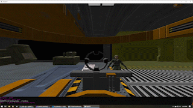
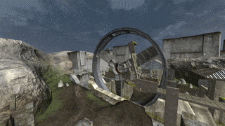


 
# OpenH2

OpenH2 is an open source game engine and tooling for Halo 2. It serves as a personal project of reverse engineering the Halo 2 (Vista) map file format. I am explicitly avoiding any reverse engineering of binaries or distributed tooling. 

# Tag Architecture

Reading of a map into tags is currently defined via set of Tag types with attributes on the properties. A deserializer type is generated at compile time by the [OpenBlam.Serialization package](https://www.nuget.org/packages/OpenBlam.Serialization/) that was created for this project.

[SceneryTag.cs](src/OpenH2.Core/Tags/SceneryTag.cs)

# Tools

## Scenario Explorer
The Scenario Explorer is the main tool used for reverse engineering the tag formats. It contains an integrated hex viewer with best-effort auto-detection of tag sections and references. In "Discovery mode" the tag tree is built based on auto-detection of tag references. In "Exploration mode" the tree is built via the static tag references in the types. The tool is built with AvaloniaUI.

## MccBulkPatcher
In order to research changes to tags and scripts, patching functionality is present in the project. This is surfaced in the MccBulkPatcher tool that can be used to apply arbitrary tag and script patches to MCC Halo 2 maps. This is currently used to create the mods I've published from base maps. ([SpeedMod](https://github.com/ronbrogan/h2-speedmod) and [Sword Playground](https://github.com/ronbrogan/mcc-mods/tree/master/h2/sword-trainer))

## Miscellaneous tooling
There are a number of other dumping and analysis tools also in the solution, but they're not intended for long term use and will eventually be removed. 

# Progress History

## [December 2020](https://youtu.be/64IwoZsDBwI)
Script execution is implemented, debug views for bones, colliders, and triggers added. Work on animations is in progress.

[https://youtu.be/64IwoZsDBwI](https://youtu.be/64IwoZsDBwI)

## [Armory Demo - November 2020](https://www.youtube.com/watch?v=l8jZkum3AOk)
Demo of the Armory (01a_tutorial) mission running in the OpenH2 engine
This is the first demo of the following features: 
 - Script Execution
 - 3D Audio Subsystem
 - AI Unit Bootstrapping

[https://www.youtube.com/watch?v=l8jZkum3AOk](https://www.youtube.com/watch?v=l8jZkum3AOk)

## [July 2020](https://www.youtube.com/watch?v=nqIXdxn6a88)
Attempted to implement an ad-hoc physics engine. After abandoning that work was done to integrate PhysX into the engine. Work on parsing game scripts is underway.

[https://www.youtube.com/watch?v=nqIXdxn6a88](https://www.youtube.com/watch?v=nqIXdxn6a88)

## [December 2019](https://www.youtube.com/watch?v=eaFrBpENgwY)
Fixed mesh loading, now loading all mesh parts, item and vehicle placements, fix for mesh normals, new shader mapping system, more scenario tag loading

[https://www.youtube.com/watch?v=eaFrBpENgwY](https://www.youtube.com/watch?v=eaFrBpENgwY)

## [November 2019](https://www.youtube.com/watch?v=EiBVZlxRlTA)
All static geometry and crate objects loading, with textures (although shaders with multiple textures aren't quite right). Animated meshes are incorrect, such as the Zanzibar house gate.

[https://www.youtube.com/watch?v=EiBVZlxRlTA](https://www.youtube.com/watch?v=EiBVZlxRlTA)

## [July 2019](https://www.youtube.com/watch?v=j3ZXj8xkp6c)
Basic map geometry and some textures loading

[https://www.youtube.com/watch?v=j3ZXj8xkp6c](https://www.youtube.com/watch?v=j3ZXj8xkp6c)