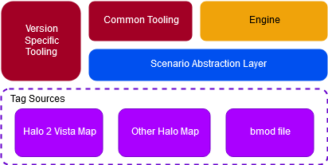
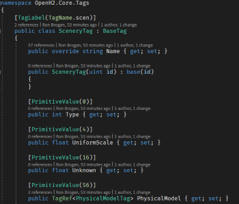
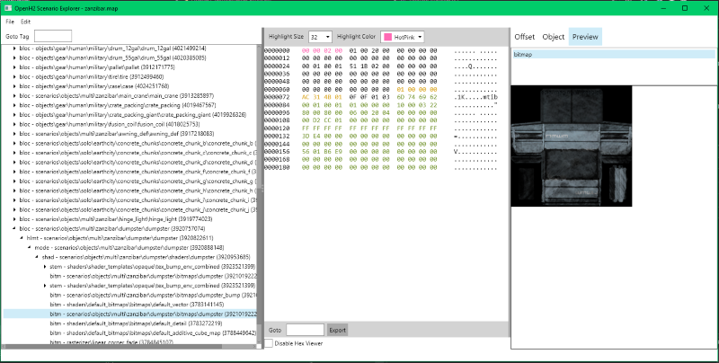
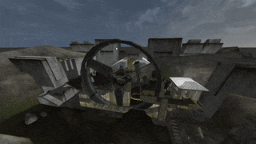


 
# OpenH2
OpenH2 is a personal project of reverse engineering the Halo 2 (Vista) map file format. I am explicitly avoiding any reverse engineering of binaries or distributed tooling. 

# General architecture
A map file is deserialized into a version-specific set of types. This map file is then translated to common format types for use in the engine by the Scenario Abstraction Layer (SAL). 

Map deserialization is currently defined via attributes on the Tag types and a deserializer type is generated by emitting the code to parse the binary map data as IL into a set of dynamic methods. 

[SceneryTag.cs](src/OpenH2.Core/Tags/SceneryTag.cs)

# Tools

## Scenario Explorer
The Scenario Explorer is the main tool used for reverse engineering the tag formats. It contains an integrated hex viewer with best-effort auto-detection of tag sections and references. In "Discovery mode" the tag tree is built based on auto-detection of tag references. In "Exploration mode" the tree is built via the static tag references in the types. The tool is built with AvaloniaUI.

## Miscellaneous tooling
There are a number of dumping and analysis tools also in the solution, but they're not intended for long term use and will eventually be removed. 

# Progress History

## November 2019
All static geometry and crate objects loading, with textures (although shaders with multiple textures aren't quite right). Animated meshes are incorrect, such as the Zanzibar house gate.

[https://www.youtube.com/watch?v=EiBVZlxRlTA](https://www.youtube.com/watch?v=EiBVZlxRlTA)

## July 2019
Basic map geometry and some textures loading

[https://www.youtube.com/watch?v=j3ZXj8xkp6c](https://www.youtube.com/watch?v=j3ZXj8xkp6c)